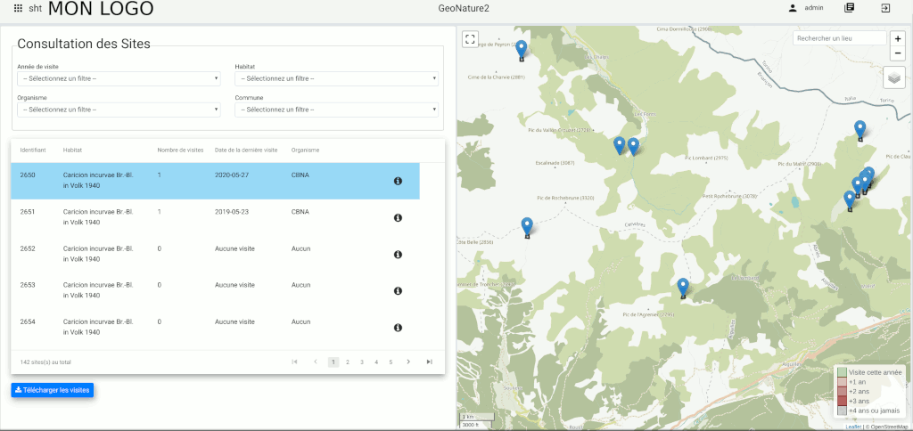

# Suivi Habitat Territoire

Module GeoNature de Suivi des Habitats sur un Territoire (SHT) du réseau Flore Sentinelle, piloté par le CBNA.

## Documentation

- [Installation et désinstallation du module](./docs/install.md)

## Licence

* [Licence OpenSource GPL v3](./LICENSE.txt)
* Copyleft 2018-2020 - Parc National des Écrins - Conservatoire National Botanique Alpin

